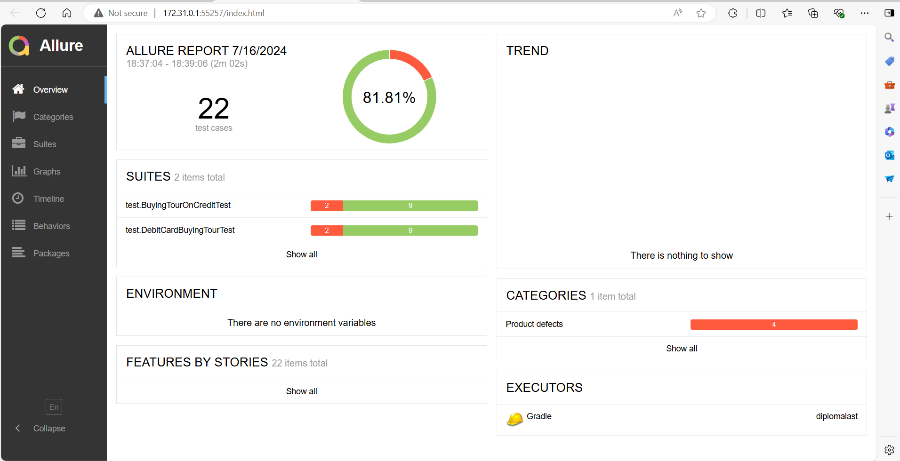
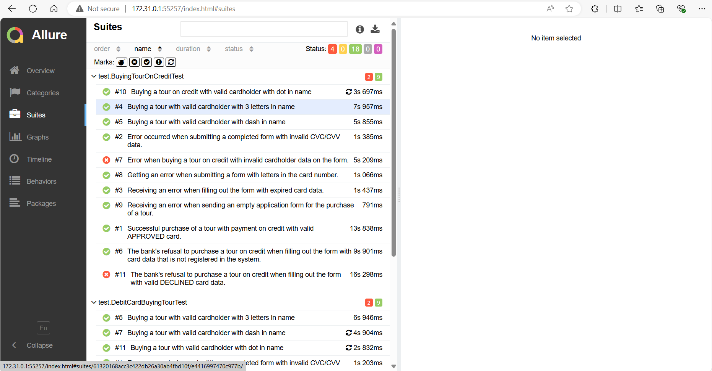
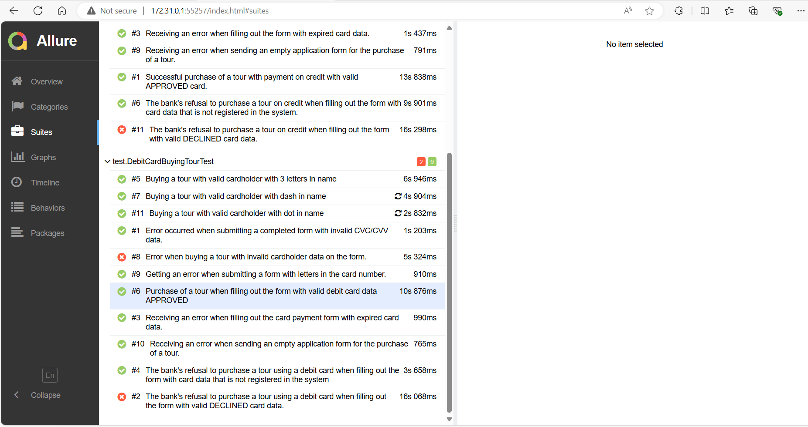

### Отчёт о проведённом тестировании

Проведено тестирование приложения — веб-сервиса, который предлагает купить тур по определённой цене двумя способами:
Обычная оплата по дебетовой карте и за счет выдачи кредита по данным банковской карты.

Автотестами проверено 22 тест-кейсов.

Результат тестирования: 81,81 % кейсов пройдены успешно.

Баг-репорты оформлены в [issue](https://github.com/lissichka123/DiplomProject/issues)

Общие рекомендации: Добавить атрибуты, которые помогают уникально идентифицировать элемент на странице. Разделить методы
оплаты на отдельные страницы.Исправить дефекты, найденные при тестировании.